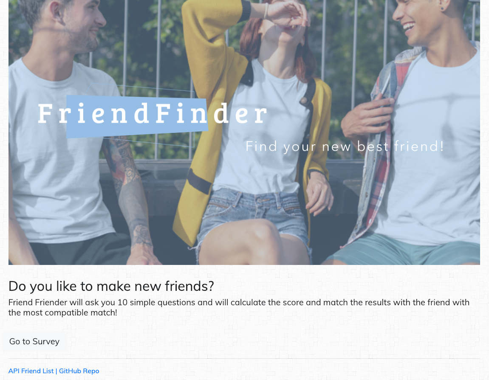
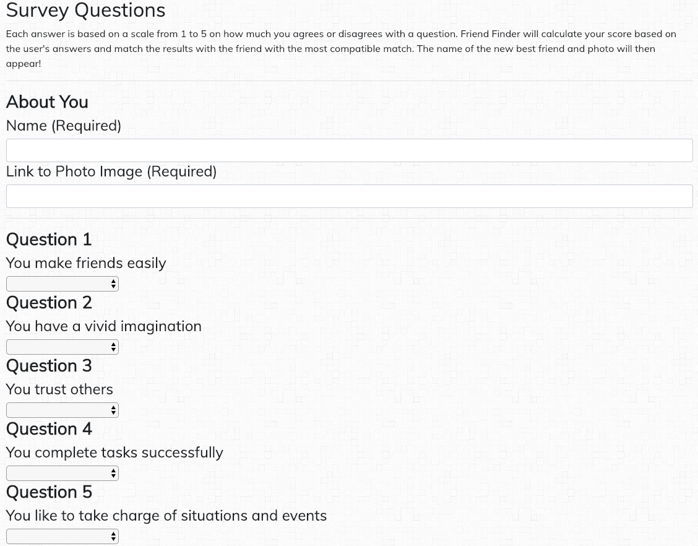

# Friend Finder
https://fathomless-plateau-41513.herokuapp.com

Simple survey to find a new best friend.

## How It Works

This full-stack site will ask 10 questions. Each answer is based on a scale from 1 to 5 on how much the user agrees or disagrees with a question.

Friend Finder will calculate the score based on the user's answers, then compare the answers with those from other users, and match the results with the friend with the most compatible match. The name of the new best friend and photo will then be displayed!

## Project Details

### Technologies Used
* Node JS
* Express
* Bootstrap 4
* HTML5

## Contributing
Pull request are welcome!

1. Friend photo is not displaying on the results page. `data.photolink` doesn't seem to grab the data for this value. 